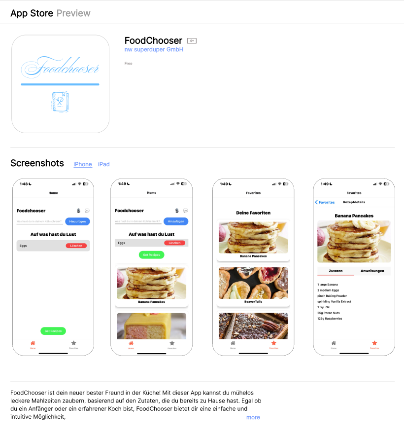

# FoodChooser - Systemdokumentation

## Anforderungen und Technologien
Die App muss mit React-Native umgesetzt und demzufolge mit JavaScript/JSX geschrieben werden. Für die Umsetzung dürfen auch Komponenten und Libraries aus dem Internet verwendet werden.
Die App soll einen echten App-Charakter und eine gute Usability aufweisen. Sie muss über mehrere Views verfügen, die untereinander verlinkt sind. Zudem müssen zwingend Sensoren in der App genutzt werden.
Für das Speichern von Daten soll die App diese dynamisch von einer Datenbank oder Datenquelle laden und beispielsweise einem REST-Service nutzen.

## Grundkonzept
FoodChooser ist eine innovative App, die es Benutzern ermöglicht, basierend auf den Zutaten, die sie bereits zu Hause haben, passende Rezepte zu finden. Das Hauptziel der App ist es, Lebensmittelverschwendung zu vermeiden und gleichzeitig kreative und leckere Mahlzeiten zu fördern. Die App bietet eine benutzerfreundliche Oberfläche, um Zutaten einzugeben, Rezepte zu durchsuchen und Lieblingsrezepte zu speichern.

## Architektur
FoodChooser verwendet die folgenden Hauptkomponenten:
- **Frontend:** Entwickelt mit React Native, um eine plattformübergreifende mobile App für iOS und Android bereitzustellen.
- **Backend:** Firebase dient als Backend-Datenbank zum Speichern von Benutzerfavoriten und Rezeptdaten.
- **APIs:** Die App integriert externe APIs wie TheMealDB, um Rezeptvorschläge basierend auf den eingegebenen Zutaten abzurufen.

### Komponenten
1. **HomeScreen:** Ermöglicht die Eingabe von Zutaten und zeigt Rezeptvorschläge an.
2. **RecipeScreen:** Zeigt die Favoritenrezepte des Benutzers an.
3. **RecipeDetailScreen:** Bietet detaillierte Anleitungen und Zutatenlisten für ausgewählte Rezepte.

## Umsetzungspunkte
- **Zutaten-Eingabe:** Benutzer können Zutaten über ein Textfeld eingeben. Die Zutaten werden lokal gespeichert und bei Bedarf abgerufen.
- **Rezeptvorschläge:** Über eine API-Anfrage an TheMealDB werden basierend auf den eingegebenen Zutaten passende Rezepte abgerufen.
- **Favoriten:** Benutzer können Rezepte durch langes Drücken als Favoriten markieren, die in Firebase gespeichert und im Favoritenbildschirm angezeigt werden.
- **Vibrationsfeedback:** Bei der Interaktion mit der App erhalten Benutzer haptisches Feedback.

# Testdokumentation

## Testkonzept
Das Testkonzept von FoodChooser zielt darauf ab, alle Kernfunktionen der App systematisch zu überprüfen, um sicherzustellen, dass sie wie erwartet funktionieren. Die Tests umfassen sowohl manuelle als auch automatisierte Tests.

### Testfälle
1. **Zutaten-Eingabe**
    - **Beschreibung:** Überprüft, ob Benutzer Zutaten eingeben und speichern können.
    - **Vorgehensweise:** Geben Sie verschiedene Zutaten in das Textfeld ein und stellen Sie sicher, dass sie in der Zutatenliste angezeigt werden.
    - **Erwartetes Ergebnis:** Alle eingegebenen Zutaten werden korrekt angezeigt und gespeichert.

2. **Rezeptvorschläge**
    - **Beschreibung:** Überprüft, ob passende Rezepte basierend auf den eingegebenen Zutaten abgerufen werden.
    - **Vorgehensweise:** Geben Sie eine Kombination von Zutaten ein und klicken Sie auf "Get Recipes".
    - **Erwartetes Ergebnis:** Eine Liste von Rezeptvorschlägen wird angezeigt.

3. **Favoriten**
    - **Beschreibung:** Überprüft die Funktion zum Hinzufügen und Anzeigen von Favoriten.
    - **Vorgehensweise:** Markieren Sie ein Rezept als Favorit durch langes Drücken und navigieren Sie zum Favoritenbildschirm.
    - **Erwartetes Ergebnis:** Das markierte Rezept wird im Favoritenbildschirm angezeigt.

4. **Rezeptdetails**
    - **Beschreibung:** Überprüft die Anzeige von Rezeptdetails.
    - **Vorgehensweise:** Klicken Sie auf ein Rezept und navigieren Sie zum Detailbildschirm.
    - **Erwartetes Ergebnis:** Die detaillierte Anleitung und Zutatenliste des Rezepts werden korrekt angezeigt.

5. **Vibrationsfeedback**
    - **Beschreibung:** Überprüft das haptische Feedback bei Interaktionen.
    - **Vorgehensweise:** Führen Sie verschiedene Interaktionen durch (z.B. langes Drücken auf ein Rezept).
    - **Erwartetes Ergebnis:** Das Gerät vibriert bei der entsprechenden Interaktion.

# App Store / Google Play Beschreibung

## FoodChooser - Dein persönlicher Rezeptassistent

### Beschreibung

**FoodChooser** ist dein neuer bester Freund in der Küche! Mit dieser App kannst du mühelos leckere Mahlzeiten zaubern, basierend auf den Zutaten, die du bereits zu Hause hast. Egal ob du ein Anfänger oder ein erfahrener Koch bist, FoodChooser bietet dir eine einfache und intuitive Möglichkeit, neue Rezepte zu entdecken und deine Lieblingsgerichte zu speichern.

### Funktionen:

- **Zutaten-Eingabe:** Gib einfach die Zutaten ein, die du im Kühlschrank hast, und FoodChooser findet passende Rezepte für dich.
- **Rezeptvorschläge:** Erhalte eine Vielzahl von Rezeptvorschlägen basierend auf deinen vorhandenen Zutaten.
- **Favoriten:** Speichere deine Lieblingsrezepte und greife jederzeit auf sie zu.
- **Detaillierte Anleitungen:** Schritt-für-Schritt-Anleitungen helfen dir, jedes Rezept mühelos nachzukochen.
- **Vibrationsfeedback:** Erhalte haptisches Feedback beim Hinzufügen von Favoriten.

### Warum FoodChooser?

- **Einfach und intuitiv:** Die benutzerfreundliche Oberfläche macht das Navigieren und Finden von Rezepten zum Kinderspiel.
- **Spart Zeit und Geld:** Vermeide Lebensmittelverschwendung, indem du Zutaten verwendest, die du bereits hast.
- **Kreativ und inspirierend:** Lass dich von neuen Rezeptideen inspirieren und erweitere deinen kulinarischen Horizont.

https://www.figma.com/design/lXplnsLm0p3oRfYTXKsAYG/expoAbschlussApp?node-id=0-1&t=UU5rSn3r8foMisT0-1